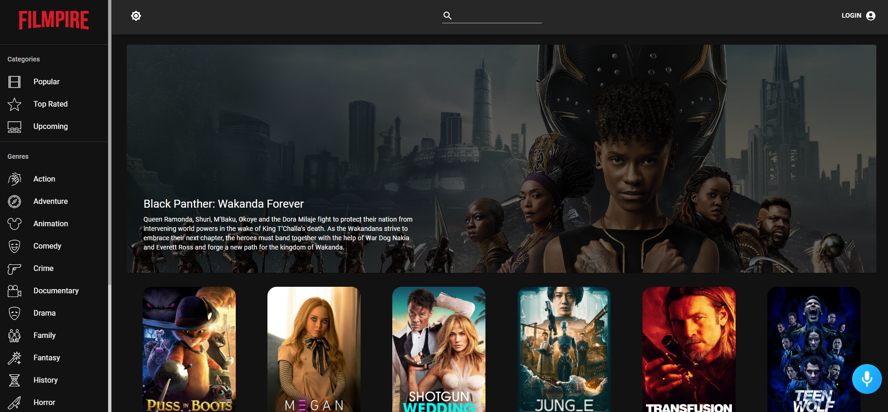

# FILMPIRE - Shubham Kadam

[View Demo](https://filmpire-ssk.netlify.app/)

## About the Project



Features include:

-   User Authentication,
-   Light and Dark mode,
-   API calls with Axios and Redux,
-   Actors and Movie Details Page,
-   Watchlist and List of Favorite Movies,
-   Movie Search Functionality,
-   Alan AI Voice Functionality and many more.

Alan works as an in-app voice assistant for the Filmpire project.

Try clicking on the blue mic icon on the bottom right of the page and try saying, "Search Batman" or "Make it light/ Make it dark" or say "Surprise me".

## Getting Started

To get a local copy up and running follow these simple steps.

### Prerequisites

List of things you need to use and how to install them:

-   npm
    ```sh
    npm install npm@latest -g
    ```

### Installation

Setup:

1. Get a free TMDB API Key at [https://www.themoviedb.org/](https://www.themoviedb.org/).
2. Clone the repo:
    ```sh
    git clone https://github.com/ShubhamSKadam/filmpire-AI_Powered_Movie_App.git
    ```
3. Install NPM packages:
    ```sh
    npm install
    ```
    Note: If you get the peer dependency error :
    ```sh
    npm install --legacy-peer-deps
    ```
4. Create your `.env` file as it is instructed in `.env.example`.
5. Enter your TMDB API key in your `.env`.

    ```sh
    REACT_APP_TMDB_KEY=<put your key here>
    ```

<!-- USAGE EXAMPLES -->

## Usage

_For more detailes regarding TMDB API calls, please refer to the [Documentation](https://developers.themoviedb.org/3/getting-started/introduction)._

See the [open issues](https://github.com/ShubhamSKadam/filmpire-AI_Powered_Movie_App/issues) for a full list of proposed features (and known issues).

## Contributing
Contributions are what makes the open source community such an amazing place to learn, inspire, and create. Any contributions you make are greatly appreciated.

If you have a suggestion that would make this better, please fork the repo and create a pull request. 
Don't forget to give the project a star⭐! Thanks again!

1. Fork the Project
2. Create your Feature Branch (git checkout -b feature/AmazingFeature)
3. Commit your Changes (git commit -m 'Add some AmazingFeature')
4. Push to the Branch (git push origin feature/AmazingFeature)
5. Open a Pull Request
